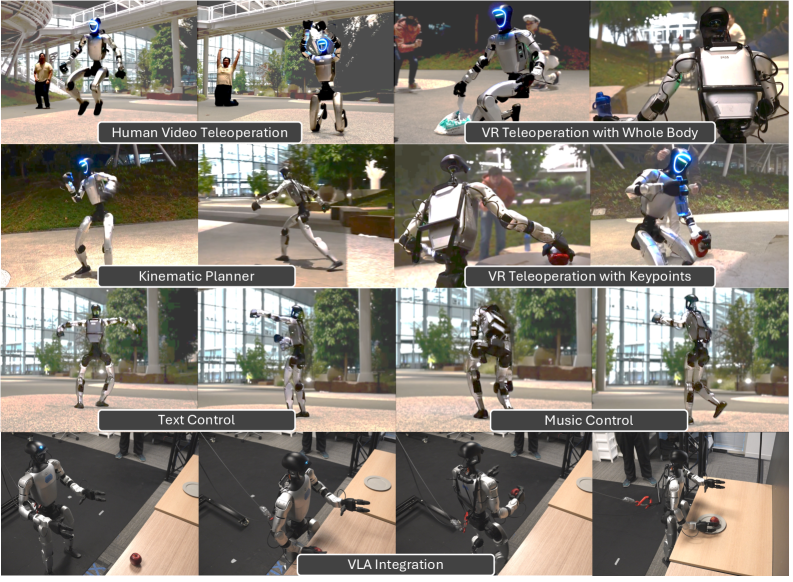
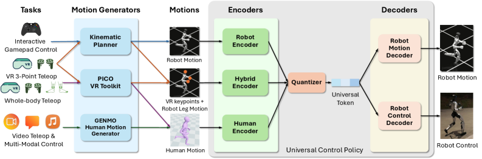
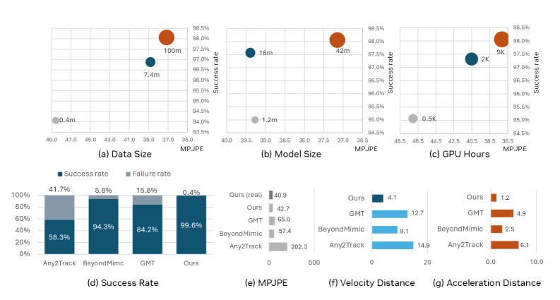
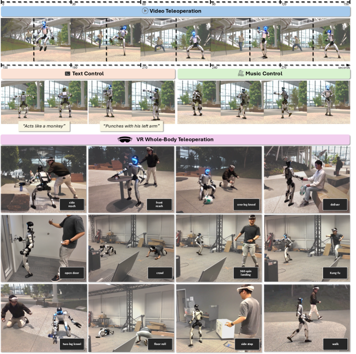
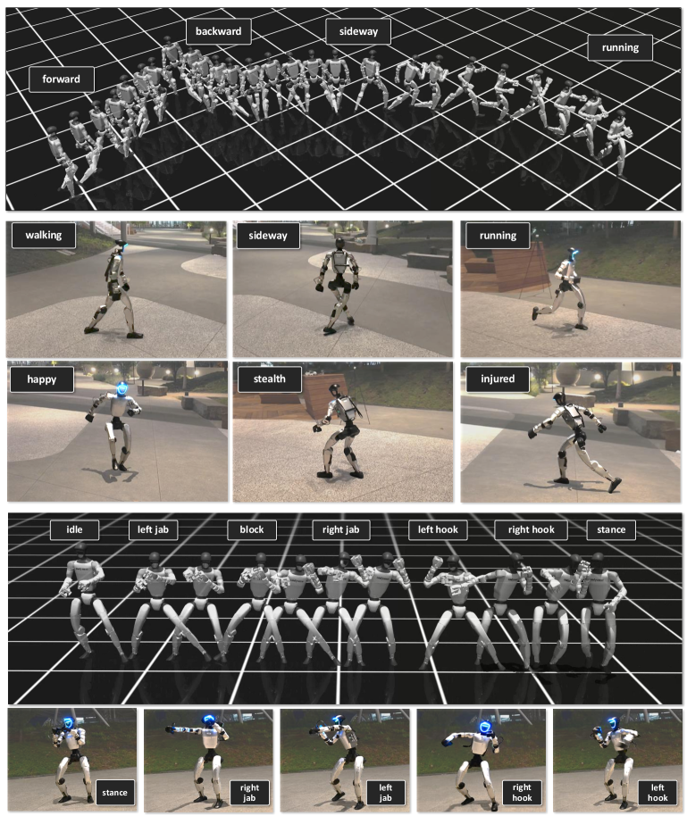
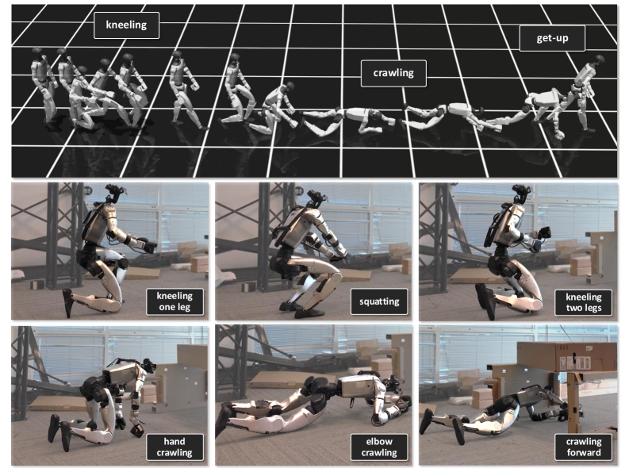
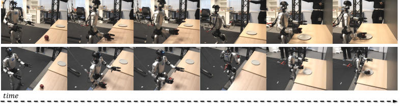

# SONIC 论文精读

> **论文标题**: SONIC: Supersizing Motion Tracking for Natural Humanoid Whole-Body Control  
> **作者**: Zhengyi Luo, Ye Yuan, Tingwu Wang, et al. (NVIDIA Research)  
> **发表**: arXiv 2025.11  
> **项目主页**: https://nvlabs.github.io/SONIC/  
> **论文链接**: https://arxiv.org/abs/2511.07820

---

## 1. 核心问题

### 1.1 研究背景

尽管 NLP/CV 领域已经展示了**十亿参数基础模型**在数千 GPU 上训练的 scaling 收益，但**人形机器人控制**领域尚未展示类似的 scaling 效果：

| 领域 | 模型规模 | 训练资源 | 效果 |
|------|----------|----------|------|
| NLP (GPT-4) | 100B+ 参数 | 数千 GPU | 通用推理 |
| CV (CLIP) | 数亿参数 | 数千 GPU | 通用视觉理解 |
| **人形控制 (现有)** | 1-5M 参数 | 少量 GPU | 有限行为集 |
| **SONIC (本文)** | **42M 参数** | **9k GPU 小时** | **通用全身控制** |

### 1.2 核心问题

**能否通过 scaling 模型容量、数据量和计算资源，构建一个通用的人形机器人运动跟踪基础模型？**

---

## 2. 核心贡献

### 2.1 三大 Scaling 维度

SONIC 沿着三个维度进行 supersizing：

```
┌─────────────────────────────────────────────────────────────┐
│                    SONIC Scaling 策略                        │
├─────────────────┬─────────────────┬─────────────────────────┤
│   网络规模       │    数据规模      │      计算规模            │
├─────────────────┼─────────────────┼─────────────────────────┤
│ 1.2M → 42M     │ 100M+ 帧        │ 9k GPU 小时             │
│ 参数           │ 700+ 小时        │ (相比现有 10-100x)       │
│ (35x 增长)      │ 高质量动作数据   │                         │
└─────────────────┴─────────────────┴─────────────────────────┘
```

### 2.2 主要贡献

1. **运动跟踪作为 scalable 任务**
   - 利用密集监督从多样化动作捕捉数据中学习
   - 无需手动奖励工程即可获得人类运动先验

2. **实时通用运动学规划器**
   - 桥接运动跟踪与下游任务执行
   - 支持自然交互式控制

3. **统一 Token 空间**
   - 支持多种运动输入接口：
     - VR 遥操作设备
     - 人体视频
     - 视觉-语言-动作 (VLA) 模型
   - 使用同一策略处理所有输入

---

## 3. 方法详解

### 3.0 系统概览



*图 1: SONIC 通过通用控制策略实现多样的人形机器人任务，支持多种输入模态和控制接口*

**支持的控制模式**:
- **Human Video Teleoperation**: 人体视频遥操作
- **VR Teleoperation with Whole Body**: 全身 VR 遥操作
- **Kinematic Planner**: 运动学规划器
- **VR Teleoperation with Keypoints**: 关键点 VR 遥操作
- **Text Control**: 文本控制
- **Music Control**: 音乐控制
- **VLA Integration**: VLA 模型集成

### 3.1 整体架构

```
┌────────────────────────────────────────────────────────────────────┐
│                         SONIC 系统架构                              │
├────────────────────────────────────────────────────────────────────┤
│                                                                    │
│   ┌──────────────┐    ┌──────────────┐    ┌──────────────┐        │
│   │  VR 设备      │    │  人体视频     │    │  VLA 模型     │        │
│   │  (3点跟踪)    │    │  (GEM 估计)   │    │  (语言指令)   │        │
│   └──────┬───────┘    └──────┬───────┘    └──────┬───────┘        │
│          │                   │                   │                │
│          └───────────────────┼───────────────────┘                │
│                              ▼                                    │
│                    ┌─────────────────────┐                        │
│                    │   统一 Token 空间    │                        │
│                    │   (Latent Space)    │                        │
│                    └──────────┬──────────┘                        │
│                               ▼                                   │
│                    ┌─────────────────────┐                        │
│                    │   42M 参数策略网络   │                        │
│                    │   (Transformer)     │                        │
│                    └──────────┬──────────┘                        │
│                               ▼                                   │
│                    ┌─────────────────────┐                        │
│                    │   人形机器人控制     │                        │
│                    │   (全身运动)        │                        │
│                    └─────────────────────┘                        │
│                                                                    │
└────────────────────────────────────────────────────────────────────┘
```

### 3.2 运动跟踪公式

**目标**: 学习策略 π，使机器人跟踪参考运动

**状态空间**:
- 机器人本体感知：关节位置、速度、IMU 数据
- 参考运动：未来 T 帧的目标姿态

**动作空间**:
- 目标关节位置（PD 控制）
- 或目标关节力矩（直接控制）

**奖励函数**:
```python
# 核心跟踪奖励
r_track = w_pos * ||p_robot - p_ref|| +      # 位置跟踪
          w_rot * ||q_robot - q_ref|| +      # 旋转跟踪
          w_vel * ||v_robot - v_ref||        # 速度跟踪

# 辅助奖励
r_aux = w_smooth * r_smooth +                # 平滑性
        w_energy * r_energy +                # 能量效率
        w_upright * r_upright                # 直立稳定性
```

### 3.3 网络架构



*图 7: GEAR-SONIC 采用通用控制策略，通过共享隐式表示无缝处理机器人运动、人体运动和混合运动*

**架构组件**:
```
输入: [本体感知 (B)] + [参考运动 (T×D)]
        │
        ▼
┌─────────────────────────────────────┐
│  本体感知编码器 (MLP)                │
│  B → 256-dim                        │
└─────────────┬───────────────────────┘
              │
              ▼
┌─────────────────────────────────────┐
│  参考运动编码器 (Transformer)        │
│  T×D → T×256-dim                    │
│  - 时序自注意力                      │
│  - 捕捉运动模式                      │
└─────────────┬───────────────────────┘
              │
              ▼
┌─────────────────────────────────────┐
│  融合编码器 (Transformer)            │
│  - 本体感知与运动特征融合             │
│  - 交叉注意力机制                    │
└─────────────┬───────────────────────┘
              │
              ▼
┌─────────────────────────────────────┐
│  策略头 (MLP)                        │
│  → 动作分布 (均值 + 方差)            │
└─────────────────────────────────────┘
```

**统一 Token 空间**:
- **Robot Encoder**: 处理纯机器人运动
- **Hybrid Encoder**: 处理 VR 关键点 + 机器人腿部运动
- **Human Encoder**: 处理人体运动
- **Quantizer**: 量化为通用 Token
- **Decoders**: 解码为机器人运动或控制信号

### 3.4 训练细节

**数据集**:
- 来源：AMASS + 内部动作捕捉数据
- 规模：100M+ 帧，700+ 小时
- 多样性：行走、跑步、跳跃、舞蹈、武术等

**训练配置**:
```yaml
算法: PPO (Proximal Policy Optimization)
并行环境: 4096
批量大小: 2M 步
学习率: 3e-4 (余弦退火)
训练时长: 9k GPU 小时 (A100)
总梯度步数: ~50B
```

---

## 4. 实验结果

### 4.1 Scaling 效果



*图 2: SONIC 的 Scaling 效果分析*

**子图说明**:
- **(a) Data Size**: 数据规模从 0.4M 到 100M 帧，成功率从 94% 提升到 98.5%
- **(b) Model Size**: 模型规模从 1.2M 到 42M 参数，MPJPE 从 39.5 降低到 37.0
- **(c) GPU Hours**: 训练时间从 0.5K 到 9K GPU 小时，成功率持续提升
- **(d) Success Rate**: 与基线方法对比，SONIC 达到 99.6% 成功率
- **(e) MPJPE**: 位置误差对比，SONIC 最低 (40.9)
- **(f) Velocity Distance**: 速度距离对比，SONIC 最优 (4.1)
- **(g) Acceleration Distance**: 加速度距离对比，SONIC 最优 (1.2)

**模型规模 vs 性能**:

| 参数量 | 跟踪误差 ↓ | 泛化能力 ↑ | 训练稳定性 |
|--------|-----------|-----------|-----------|
| 1.2M   | 高        | 差        | 不稳定    |
| 5M     | 中        | 一般      | 一般      |
| 15M    | 低        | 好        | 稳定      |
| **42M**| **极低**  | **优秀**  | **非常稳定** |

**数据规模 vs 性能**:

| 数据量 | 跟踪质量 | 泛化到未见动作 |
|--------|----------|---------------|
| 10 小时 | 一般     | 差            |
| 100 小时 | 好      | 一般          |
| **700+ 小时** | **优秀** | **优秀** |

### 4.2 与现有方法对比

| 方法 | 参数量 | 实时性 | 泛化性 | 自然度 |
|------|--------|--------|--------|--------|
| PIP    | ~1M   | ✅     | ⚠️     | ⭐⭐⭐   |
| HMD-Poser | ~2M | ✅   | ⚠️     | ⭐⭐⭐   |
| OmniH2O | ~5M  | ✅     | ✅     | ⭐⭐⭐⭐  |
| **SONIC** | **42M** | **✅** | **✅** | **⭐⭐⭐⭐⭐** |

### 4.3 应用场景展示

#### 1. VR 遥操作 (3点跟踪)



*图 5: SONIC 支持多种控制模式，包括视频遥操作、文本控制、音乐控制和 VR 全身遥操作*

**控制模式**:
- **Video Teleoperation**: 视频遥操作，实时跟踪人体动作
- **Text Control**: 文本控制，如 "Acts like a monkey", "Punches with his left arm"
- **Music Control**: 音乐控制，根据节拍生成舞蹈动作
- **VR Whole-Body Teleoperation**: VR 全身遥操作，支持复杂交互任务

#### 2. 运动学规划器



*图 3: 运动学规划器支持多种运动风格和动作序列*

**支持的移动风格**:
- **forward/backward/sideway**: 前后左右移动
- **running**: 跑步
- **walking**: 行走
- **happy**: 快乐风格
- **stealth**: 潜行风格
- **injured**: 受伤风格

**拳击动作序列**:
- idle → left jab → block → right jab → left hook → right hook → stance



*图 4: 运动学规划器支持低姿态运动，包括跪姿、蹲姿和爬行*

**低姿态运动**:
- **kneeling**: 单膝跪地、双膝跪地
- **squatting**: 深蹲
- **crawling**: 手爬、肘爬、前进爬
- **get-up**: 从地面站起

#### 3. VLA 集成



*图 6: SONIC 与 VLA 基础模型 (GR00T N1.5) 集成，实现移动操作任务*

**任务展示**:
- 移动操作任务序列
- 95% 成功率
- 结合高级推理与快速反应控制

---

## 5. 关键洞察

### 5.1 Scaling 定律在人形控制中存在

```
性能
  │
  │      ╭────── 42M (SONIC)
  │     ╱
  │    ╱   ╭──── 15M
  │   ╱   ╱
  │  ╱   ╱   ╭── 5M
  │ ╱   ╱   ╱
  │╱   ╱   ╱   ╭─ 1.2M
  └───────────────────────
    1M  5M  15M  42M    参数量
```

**发现**:
- 性能随模型规模单调提升
- 未观察到性能饱和
- 更大的模型 = 更好的泛化

### 5.2 运动跟踪是理想的 scalable 任务

**为什么运动跟踪适合 scaling？**

1. **密集监督**: 每帧都有明确的跟踪目标
2. **数据丰富**: 动作捕捉数据容易获取
3. **任务通用**: 跟踪能力可迁移到各种下游任务
4. **无需奖励工程**: 自动从数据中学习

### 5.3 统一 Token 空间的价值

```
不同输入 → 统一表示 → 同一策略

VR 设备 ──┐
视频 ─────┼──→ Latent Token ──→ SONIC Policy ──→ 机器人
文本 ─────┤
VLA ──────┘
```

**优势**:
- 一次训练，多种应用
- 新接口只需训练轻量级编码器
- 策略网络可复用

---

## 6. 局限性与未来工作

### 6.1 局限性

1. **计算成本**
   - 9k GPU 小时训练成本高昂
   - 需要大规模集群

2. **Sim-to-Real 差距**
   - 主要在仿真中验证
   - 真实机器人部署需额外工作

3. **数据偏差**
   - 动作捕捉数据主要来自人类
   - 机器人动力学与人类不同

4. **实时性限制**
   - 需要高性能 GPU
   - 边缘设备部署挑战

### 6.2 未来方向

1. **更大规模**: 100M+ 参数，10k+ GPU 小时
2. **真实世界数据**: 从真实机器人交互中学习
3. **多机器人**: 单一策略控制多种机器人形态
4. **在线适应**: 实时适应新环境和任务
5. **世界模型集成**: 结合预测模型进行长期规划

---

## 7. 与相关工作的关系

### 7.1 与 PIP (CVPR 2022) 的关系

| 方面 | PIP | SONIC |
|------|-----|-------|
| 规模 | 1M 参数 | 42M 参数 |
| 数据 | 有限 | 700+ 小时 |
| 方法 | 物理感知 | 纯数据驱动 |
| 泛化 | 有限 | 优秀 |

**关系**: SONIC 是 PIP 的 scaling 版本，证明数据驱动的 scaling 优于手工设计的物理约束。

### 7.2 与 GMR (ICRA 2026) 的关系

| 方面 | GMR | SONIC |
|------|-----|-------|
| 任务 | 运动重定向 | 运动跟踪 |
| 输入 | 人体动作 | 多种接口 |
| 输出 | 机器人动作 | 机器人控制 |
| 关系 | 上游处理 | 下游执行 |

**关系**: GMR + SONIC = 完整 pipeline
- GMR 将人体动作重定向到机器人
- SONIC 跟踪执行重定向后的动作

### 7.3 与 TWIST (arXiv 2025) 的关系

TWIST 使用 GMR 进行重定向，SONIC 可作为其跟踪策略的升级版本。

---

## 8. 实践建议

### 8.1 复现建议

```bash
# 硬件要求
GPU: 8x A100 (80GB)
内存: 512GB+
存储: 10TB+ (数据集)

# 训练时间
预计: 7-10 天 (8x A100)
```

### 8.2 使用建议

1. **数据收集**
   - 优先收集多样化动作
   - 质量 > 数量 (但两者都重要)

2. **训练策略**
   - 从小模型开始调参
   - 确认有效后再 scaling
   - 使用课程学习

3. **部署考虑**
   - 需要高性能推理硬件
   - 考虑模型蒸馏压缩

---

## 9. 总结

**SONIC 的核心价值**:

1. **证明了 scaling 在人形控制中的有效性**
   - 35x 参数增长 → 显著性能提升
   - 未观察到饱和现象

2. **建立了运动跟踪基础模型**
   - 通用、可扩展、多接口
   - 为下游任务提供坚实基础

3. **提供了实用的系统**
   - 实时运行
   - 多种输入接口
   - 高成功率

**一句话总结**:
> SONIC 将 NLP/CV 领域的 scaling 范式成功应用于人形机器人控制，通过 42M 参数和 700+ 小时数据训练出通用的运动跟踪基础模型。

---

## 参考资源

- **论文**: https://arxiv.org/abs/2511.07820
- **项目主页**: https://nvlabs.github.io/SONIC/
- **相关论文**:
  - PIP (CVPR 2022): https://arxiv.org/abs/2203.16441
  - GMR (ICRA 2026): https://arxiv.org/abs/2510.02252
  - TWIST (arXiv 2025): https://arxiv.org/abs/2505.02833

---

*精读完成时间: 2026-02-24*  
*建议配合项目主页视频理解效果*
